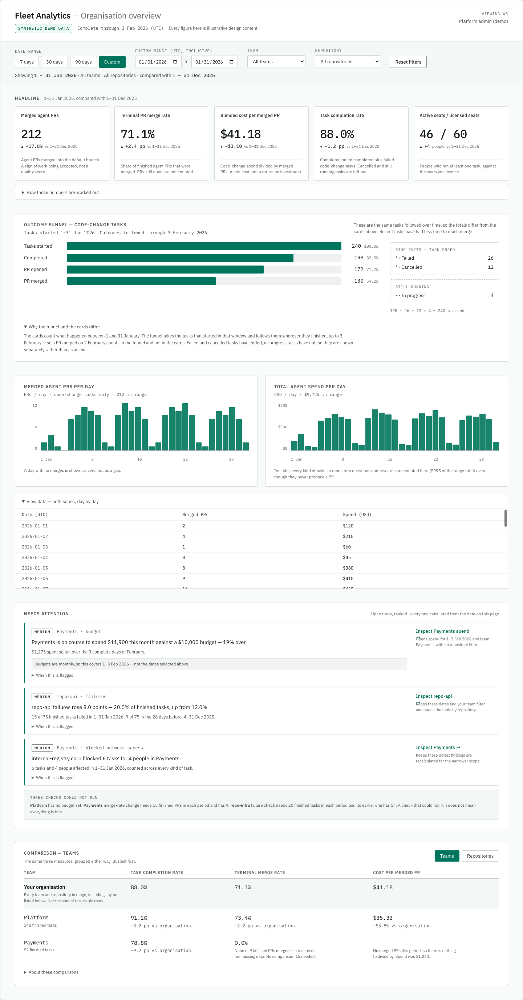

# 02 — Requirements

> **Purpose:** turn the frozen P0 scope into a customer experience with testable acceptance criteria.
> The [frozen scope](00-research.md#7-prototype-p0--frozen) defines the feature list; the [metrics contract](01-metrics-contract.md) defines calculations and states. The criteria below link to those definitions rather than repeating formulas.
> Out of scope here: API routes, component libraries, storage, authentication mechanisms, deployment.

## 1. Goal, personas and scope

**The decision the page supports.** An engineering leader reviewing the organisation weekly asks: *is Fleet producing accepted code changes at a sustainable cost, and where should we act this week?* The page should leave them with at most three things worth raising. See the [product framing](00-research.md#4-the-one-question-and-the-four-underneath-it).

| Persona | Journey | Entry point |
|---|---|---|
| **P1 engineering leader** (primary) | read the organisation-wide result and stop | KPI row, unfiltered |
| **P2 team lead** (secondary) | investigate a gap against the org benchmark | team filter, comparison table |
| **P3 platform admin** (secondary) | inspect a computed finding and follow it | needs-attention panel |

**Scope** is exactly [Prototype P0 — frozen](00-research.md#7-prototype-p0--frozen): one page, five KPI cards, cohort funnel, two trends, needs-attention panel, one comparison table with team and repository views, under date/team/repository filters reflected in the URL. No individual-user analytics, no exports, no custom dashboards, no additional metric sub-lines.

**Demo framing.** The application is labelled as running on **synthetic demo data** (AC-01.2).

**Authentication is in scope.** Users sign in with a **username and password**; the API is authenticated by a short-lived JWT, and the **organisation scope and role come from the verified identity** — never from a client parameter. Two roles share one dashboard: `ADMIN` sees denied-domain detail, `VIEWER` sees a redacted form with the same counts (AC-06.9). The shipped demo installs **two organisations**, configured in [Demo data](04-technical-spec.md#6-demo-data); a user views the other by logging out and signing in with its account, as there is no organisation switcher. Fixture counts and demo credentials are not repeated here. Requirements for a production deployment remain in [Prototype controls and additional production requirements](#72-prototype-controls-and-additional-production-requirements).

## 2. Page structure and visual reference

Order is fixed by [Prototype P0 — frozen](00-research.md#7-prototype-p0--frozen): KPI row → funnel → trends → needs-attention → comparison table. Both trends are **separate single-axis charts**; no dual-axis chart is required.

[View the 375px mobile design](mobile-375.png)

**How to read these images.**

- They are the **approved layout and visual-hierarchy references** for the page — not a component, styling or CSS specification.
- Their numbers illustrate **one synthetic scenario**. Implementation must calculate every displayed value from data using [metrics contract](01-metrics-contract.md); dashboard results must not be hard-coded to match the screenshots, though a deterministic mock dataset may reproduce the illustrated scenario.
- The written acceptance criteria in [User stories and acceptance criteria](#3-user-stories-and-acceptance-criteria) and the non-functional requirements in [Non-functional acceptance](#5-non-functional-acceptance) govern **behaviour and accessibility**. Static images illustrate selected states; they do not verify implemented interactions, keyboard accessibility, or loading, error, empty and unavailable-state behaviour.
- If an image conflicts with [metrics contract](01-metrics-contract.md) or with a written acceptance criterion, **follow the written specification and flag the discrepancy** rather than implementing the image.

## 3. User stories and acceptance criteria

### US-01 — Understand the organisation overview

*As an engineering leader, I want the headline result above the fold so I can decide whether anything needs my attention.*

- **AC-01.1** Given the default view, When the page loads, Then exactly five KPI cards appear in the order of [Prototype P0 — frozen](00-research.md#7-prototype-p0--frozen), each showing a value, **one** comparison presentation, and a one-line definition — and no sub-lines or second delta badge.
- **AC-01.2** Given any view, Then a persistent "synthetic demo data" indicator is visible without scrolling.
- **AC-01.3** Given any view, Then the reporting cutoff is stated as a UTC date derived from `dataThrough − 1 day` ([Conventions](01-metrics-contract.md#11-conventions) and [Cohort funnel and residuals](01-metrics-contract.md#4-cohort-funnel-and-residuals)).
- **AC-01.4** Given a card whose value is defined, When its comparison is suppressed, Then the value still renders and the comparison area shows the contract's reason ([Result envelope](01-metrics-contract.md#12-result-envelope)), never a blank, a zero, or a neutral "flat" badge.
- **AC-01.5** Given a period with positive spend and zero merged PRs, Then cost per merged PR renders as unavailable with the copy "no merged PRs in this period" ([Blended cost per merged PR](01-metrics-contract.md#33-blended-cost-per-merged-pr)) and **is not** labelled "no activity".
- **AC-01.6** Given a **rate** metric (terminal merge rate, task completion rate), Then `zero_outcome` renders as a real `0.0%` and `no_denominator` renders as unavailable with its reason, the two being visually and textually distinct ([Result envelope](01-metrics-contract.md#12-result-envelope)). This criterion is about rate metrics only: a zero **monetary** value keeps monetary formatting (`$0.00`, [Display formatting](01-metrics-contract.md#86-display-formatting)) and a zero **count** keeps integer formatting; `zero_outcome` never means every metric prints `0.0%`.
- **AC-01.7** Given each KPI card, Then it displays exactly the one comparison type below, and no other:

  | Card | Displayed comparison |
  |---|---|
  | Merged agent PRs | relative percentage change |
  | Terminal PR merge rate | percentage-point change |
  | Blended cost per merged PR | absolute USD change |
  | Task completion rate | percentage-point change |
  | Active seats | absolute change in active-user count |

- **AC-01.8** Given a card whose displayed comparison is unavailable under [Result envelope](01-metrics-contract.md#12-result-envelope) or [Benchmark and sample gates](01-metrics-contract.md#54-benchmark-and-sample-gates), Then the card explains why in place of the delta, and **does not** substitute a different comparison type, add a second badge, or fall back silently. The contract may compute comparisons that are not displayed ([Merged agent PRs](01-metrics-contract.md#31-merged-agent-prs) through [Active seats / licensed seats](01-metrics-contract.md#35-active-seats--licensed-seats)); only the type in AC-01.7 is shown.

### US-02 — Change, reset, bookmark and restore filters

*As any user, I want the view I am looking at to be the view I can share and return to.*

- **AC-02.1** Given the page with no URL parameters, Then the date range defaults to the **last 30 complete UTC days ending at `dataThrough`**, with all teams and all repositories selected.
- **AC-02.2** Given the filter bar, Then 7-, 30- and 90-day presets and a custom inclusive date range are offered; the selected range is displayed as inclusive UTC dates ([Conventions](01-metrics-contract.md#11-conventions)).
- **AC-02.3** Given any filter change, Then the URL updates to encode date range, team and repository, and the displayed "Showing …" label matches the URL.
- **AC-02.4** Given a URL with filters and a **valid authenticated session**, When the page is reached by browser back or forward, Then the same view is restored with no additional interaction and without signing in again. When the page is **refreshed**, the in-memory token is lost, so signing in is required again; after signing in as the same user, the URL's dates, filters and grouping are restored without being re-entered (AC-09.15). An expired session follows the same reauthentication behaviour.
- **AC-02.5** Given a team filter and a repository filter, Then results reflect their **intersection**, and the labels name both.
- **AC-02.6** Given a valid filter combination that matches no activity, Then the page renders an **empty result** with zero counts ([Data coverage](01-metrics-contract.md#15-data-coverage)) and a reset action — not an error. Zero-activity messaging applies **per metric**, against that metric's own scope and timestamp basis ([Lifecycle and timestamp basis](01-metrics-contract.md#2-lifecycle-and-timestamp-basis)), and must not be stated as a page-wide "no activity".
- **AC-02.7** Given a malformed, reversed, or not-fully-covered date range ([Data coverage](01-metrics-contract.md#15-data-coverage)), Then the request is rejected with a message naming the specific problem, and no metrics are rendered.
- **AC-02.8** Given an unknown team or repository id in the URL, Then the page states that the filter refers to something absent from the demo dataset and offers Reset; it **must not** render unfiltered results under filtered labels.
- **AC-02.9** Given Reset, Then the default date range and all teams/repositories are restored and the URL is updated accordingly.

### US-03 — Interpret the cohort funnel and its dates

*As a team lead, I want to know which tasks the funnel counts and how far outcomes were observed.*

- **AC-03.1** Given the funnel, Then four stages appear in [Cohort funnel and residuals](01-metrics-contract.md#4-cohort-funnel-and-residuals) order with task counts, and the rendered stages are non-increasing.
- **AC-03.2** Given the funnel, Then `failed` and `cancelled` appear as **side exits** and `in_progress` as a **residual**, visually distinguished from each other and from the stages ([Cohort funnel and residuals](01-metrics-contract.md#4-cohort-funnel-and-residuals)).
- **AC-03.3** Given the funnel, Then the label states the selected period and the observation cutoff in the wording of [Cohort funnel and residuals](01-metrics-contract.md#4-cohort-funnel-and-residuals).
- **AC-03.4** Given the funnel, Then copy explains that recent cohorts have had less time to reach merge, with **no** numeric maturity threshold stated ([Cohort funnel and residuals](01-metrics-contract.md#4-cohort-funnel-and-residuals)).
- **AC-03.5** Given the funnel and the KPI row, Then the page states that the two need not reconcile and why ([Cohort funnel and residuals](01-metrics-contract.md#4-cohort-funnel-and-residuals)), rather than presenting them as the same population.
- **AC-03.6** Given the funnel, Then `completed + failed + cancelled + in_progress` equals `started` as displayed ([Cohort funnel and residuals](01-metrics-contract.md#4-cohort-funnel-and-residuals)).

### US-04 — Inspect outcome and spend trends

*As an engineering leader, I want to see whether merged output and spend are moving.*

- **AC-04.1** Given the selected range, Then two separate charts render — merged agent PRs per day and agent spend per day — each with its own single axis and an explicit unit label (`PRs/day`, `USD/day`).
- **AC-04.2** Given a day inside coverage with no matching records, Then the day plots as `0`, not as a gap ([Trends](01-metrics-contract.md#51-trends)).
- **AC-04.3** Given either chart, Then a textual or tabular equivalent of the plotted series is available on the page (AC-08.5).
- **AC-04.4** Given the spend trend, Then it is labelled as covering all task types, and the merged-PR trend as code-change tasks only ([Trends](01-metrics-contract.md#51-trends) and [Eligibility](01-metrics-contract.md#14-eligibility)).

### US-05 — Compare teams and repositories against the benchmark

*As a team lead, I want to see where my team sits relative to the organisation.*

- **AC-05.1** Given the comparison table, Then a view switch offers Teams and Repositories, and switching changes **only the grouping** — column definitions and formulas are unchanged ([Benchmark and sample gates](01-metrics-contract.md#54-benchmark-and-sample-gates)).
- **AC-05.2** Given either view, Then an organisation benchmark row is shown and labelled so that it states (a) it **includes the selected team's own contribution** and (b) under an active team filter it **may include teams that are not displayed**. The label must not describe the benchmark as the aggregate of only the visible rows ([Benchmark and sample gates](01-metrics-contract.md#54-benchmark-and-sample-gates)).
- **AC-05.3** Given a team filter is active, Then the benchmark ignores that team filter and **still honours the repository filter**, and the label says so; the displayed rows and the benchmark can therefore cover different populations ([Benchmark and sample gates](01-metrics-contract.md#54-benchmark-and-sample-gates)).
- **AC-05.4** Given a row whose metric value is undefined or whose comparison is suppressed, Then the row remains visible and the affected cell shows the contract's state and reason ([Result envelope](01-metrics-contract.md#12-result-envelope) and [Benchmark and sample gates](01-metrics-contract.md#54-benchmark-and-sample-gates)).
- **AC-05.5** Given the default ordering, Then rows sort by eligible terminal task count descending ([Task completion rate](01-metrics-contract.md#34-task-completion-rate) population), tie-broken by display name ascending then id ascending, with the benchmark row pinned first — deterministic across reloads.
- **AC-05.6** Given a user selects or focuses a table row, Then the benchmark values do not change ([Benchmark and sample gates](01-metrics-contract.md#54-benchmark-and-sample-gates)).
- **AC-05.7** Given a table grouping (Teams or Repositories), Then the grouping is encoded in the URL and restored on refresh and on browser back/forward, so a link can open a specific grouping. Route and parameter naming are [technical guide](04-technical-spec.md) decisions.

### US-06 — Inspect and follow computed attention findings

*As a platform admin, I want to know what to look at first and to get there.*

- **AC-06.1** Given the panel, Then **at most three** findings render, ordered by [Identity, deduplication and selection](01-metrics-contract.md#65-identity-deduplication-and-selection), and the order is identical across reloads of the same URL.
- **AC-06.2** Given a finding, Then it states severity, the affected scope, and the evidence including the threshold crossed — **inside the finding**, not behind the link ([Attention rules](01-metrics-contract.md#6-attention-rules), [The needs-attention panel](00-research.md#8-the-needs-attention-panel)).
- **AC-06.3** Given the panel, Then it renders exactly one of these **five** states. The cases are exhaustive and mutually exclusive: they partition on *findings exist or not*, then on *at least one evaluation completed*, then on *any evaluation unavailable*. An **evaluation-limit notice** lists the scopes and rules that could not be evaluated and the contract reason for each — unavailable budget scope under a repository filter ([Filter exceptions (must be visible on screen)](01-metrics-contract.md#53-filter-exceptions-must-be-visible-on-screen) and [Budget risk](01-metrics-contract.md#61-budget-risk)), insufficient history or samples ([Budget risk](01-metrics-contract.md#61-budget-risk) through [Terminal merge-rate decline](01-metrics-contract.md#63-terminal-merge-rate-decline)), missing sources or uncovered baselines ([Data coverage](01-metrics-contract.md#15-data-coverage)), and missing or invalid budget configuration ([Budget risk](01-metrics-contract.md#61-budget-risk)). No state may imply overall system health.

  | # | Findings | Completed evaluations | Unavailable evaluations | Panel shows |
  |---|---|---|---|---|
  | a | ≥ 1 | ≥ 1 | none | the ranked findings, **no** evaluation-limit notice |
  | b | ≥ 1 | ≥ 1 | ≥ 1 | the ranked findings **plus** the evaluation-limit notice |
  | c | none | ≥ 1 | none | "No configured alerts triggered." |
  | d | none | ≥ 1 | ≥ 1 | "No alerts triggered among evaluated rules," **plus** the evaluation-limit notice with reasons |
  | e | none | **0** | any | a statement that alerts could not be evaluated — why evaluation was unavailable, or that no scopes were applicable. **Never** a claim of health |

  The three-finding cap (AC-06.1) is unchanged in every case.
- **AC-06.4** Given a **budget** finding, When its link is followed, Then the page opens the **spend trend** with the date range set to the finding's **evaluated month-to-date** ([Budget risk](01-metrics-contract.md#61-budget-risk)); sets the team filter to the finding's team, or **clears** the team filter for an organisation finding; **clears any repository restriction**, because budgets have no repository allocation ([Filter exceptions (must be visible on screen)](01-metrics-contract.md#53-filter-exceptions-must-be-visible-on-screen) and [Budget risk](01-metrics-contract.md#61-budget-risk)); and explains on screen that the reporting period differs from the range previously selected.
- **AC-06.5** Given a **non-budget** finding, When its link is followed, Then all of the following hold: the **evaluated date range is preserved**; any existing filter on the *other* dimension is **preserved**; the finding's own scope is applied to its dimension so the population is **narrowed, never broadened** beyond the one that produced the finding ([Filter application](01-metrics-contract.md#60-filter-application)).
- **AC-06.6** Given a **failure-spike** or **merge-decline** finding, When its link is followed, Then the comparison table is switched to the grouping matching the finding's scope type — Repositories for a repository scope, Teams for a team scope (AC-05.7) — and the affected row is brought into view.
- **AC-06.7** Given a **network-policy-friction** finding, When its link is followed, Then the page lands at the needs-attention section under the filters and date behaviour of AC-06.5, and findings are **recomputed and reranked** for that filtered scope using the unchanged metrics contract ([Filter application](01-metrics-contract.md#60-filter-application) and [Network-policy friction](01-metrics-contract.md#64-network-policy-friction), [Identity, deduplication and selection](01-metrics-contract.md#65-identity-deduplication-and-selection)). Both outcomes are acceptance conditions:
  - **Still in the top three** — the originating finding renders normally, showing its **newly computed** evidence for the filtered scope (domain shown where AC-06.9 permits).
  - **No longer in the top three** — a concise navigation notice explains that findings were reranked for the filtered scope. The originating finding is **not** pinned, **no** fourth finding is displayed, and its previous evidence is **not** retained as a current result.
- **AC-06.8** Given a followed finding link, Then the destination view, read on its own, states the filters, table grouping and date range in effect.
- **AC-06.9** Given a signed-in `ADMIN`, Then a network-policy-friction finding may display the synthetic denied domain; given a `VIEWER`, Then the domain is absent while the counts are identical ([Network-policy friction](01-metrics-contract.md#64-network-policy-friction), [Privacy principle](00-research.md#9-privacy-principle)).
- **AC-06.10** Given any finding link, Then its destination is an existing P0 section; **no** link promises a failure-reason or denied-domain view ([Deferred for the prototype — research candidates](00-research.md#101-deferred-for-the-prototype--research-candidates)).
- **AC-06.11** Given a followed finding link of any type, When the user presses browser back, Then the originating URL is restored — including the originating team and repository filters, date range **and table grouping** (AC-05.7).
- **AC-06.12** Given team **Payments** is selected and a **repo-api** failure-spike finding is shown, When that finding is followed, Then the team filter remains **Payments**, the repository filter becomes **repo-api**, the date range is unchanged, and the comparison table opens in the **Repositories** grouping with the repo-api row in view.
- **AC-06.13** Given an evaluation-limit notice (AC-06.3), Then it is rendered compactly, is not styled or counted as a finding, and does **not** consume any part of the three-finding cap ([Identity, deduplication and selection](01-metrics-contract.md#65-identity-deduplication-and-selection)).

### US-07 — Understand loading, empty, unavailable and error states

*As any user, I want to know whether a number is missing, zero, or not yet loaded.*

- **AC-07.1** Given a filter change, When results are pending, Then affected sections show a loading state and **do not** display the previous selection's values.
- **AC-07.2** Given two filter changes in quick succession, When the earlier response arrives last, Then it is discarded and the latest selection's results remain displayed.
- **AC-07.3** Given a covered period with no matching records, Then counts and spend render as `0` with an explanation and a reset action ([Data coverage](01-metrics-contract.md#15-data-coverage)) — distinct from a failure. The explanation names the metric's own scope and timestamp basis ([Lifecycle and timestamp basis](01-metrics-contract.md#2-lifecycle-and-timestamp-basis)), so an empty funnel and an empty merged-PR count are explained separately rather than as one page-wide state.
- **AC-07.4** Given a comparison suppressed by a sample gate, Then the message names the gate that was not met ([Benchmark and sample gates](01-metrics-contract.md#54-benchmark-and-sample-gates)) and the raw value remains visible.
- **AC-07.5** Given a team or repository filter, Then the active-seat **count** renders and the utilisation ratio renders as unavailable with the reason that seat allocation is not defined for that scope ([Active seats / licensed seats](01-metrics-contract.md#35-active-seats--licensed-seats) and [Filter exceptions (must be visible on screen)](01-metrics-contract.md#53-filter-exceptions-must-be-visible-on-screen)).
- **AC-07.6** Given a required source missing for a covered period, Then only the dependent metrics render as unavailable — including counts — while unrelated sections keep rendering ([Data coverage](01-metrics-contract.md#15-data-coverage) and [Merged agent PRs](01-metrics-contract.md#31-merged-agent-prs)).
- **AC-07.7** Given a recoverable failure, Then an error message and a retry action are shown, and retrying preserves the current filters and URL.
- **AC-07.8** Given the selected period has no activity, Then a **budget finding remains displayed** if its own month-to-date evaluation triggered: budget is evaluated over a separate calendar month independent of the selected range ([Budget risk](01-metrics-contract.md#61-budget-risk)), so page-level emptiness must never suppress it.

### US-08 — Use the page by keyboard and on a narrow screen

*As any user, I want the page to work without a mouse and on a phone.*

- **AC-08.1** Given keyboard-only navigation, Then date presets, the custom range inputs, team and repository selectors, Reset, the table view switch, and every finding link are reachable and operable in a logical order.
- **AC-08.2** Given any focusable control, Then a visible focus indicator is present.
- **AC-08.3** Given every control, Then it has an accessible name that matches its visible label.
- **AC-08.4** Given a 375px-wide viewport, Then the page has no horizontal scrolling at page level; a table wider than the viewport scrolls inside its own labelled region.
- **AC-08.5** Given every chart and the funnel, Then the same information is available as text or a table.
- **AC-08.6** Given any state conveyed by colour — severity, delta direction, unavailability — Then it is also conveyed by text or shape.

### Coverage of the P0 surface

Every surface in [Prototype P0 — frozen](00-research.md#7-prototype-p0--frozen) has at least one acceptance criterion, and every cross-cutting state rule has one.

| P0 surface ([Prototype P0 — frozen](00-research.md#7-prototype-p0--frozen)) | Primary ACs | State / access ACs |
|---|---|---|
| Five KPI cards | AC-01.1, AC-01.4–01.8 | AC-07.1, AC-07.4–07.6, AC-08.6 |
| Cohort funnel and residuals | AC-03.1–03.6 | AC-08.5 |
| Merged-PR and spend trends | AC-04.1–04.4 | AC-04.2, AC-08.5 |
| Needs-attention panel | AC-06.1–06.13 | AC-06.3, AC-06.13, AC-07.8, AC-08.1 |
| Comparison table, team/repository views | AC-05.1–05.7 | AC-05.4, AC-05.7, AC-08.4 |
| Global filters reflected in the URL | AC-02.1–02.9, AC-05.7 | AC-02.6–02.8, AC-07.2, AC-07.8 |
| Demo-data labelling and cutoff | AC-01.2, AC-01.3 | NFR-7 |
| Admin-visible denied domain | AC-06.9 | AC-09.8, AC-09.9, PR-2, PR-3 |
| Login, tenancy and role | AC-09.1–09.16 | AC-02.8, AC-07.7 |

### US-09 — Sign in, and see only my organisation

*As a user of either organisation, I want to sign in and see my own organisation's data, with my role's level of detail.*

- **AC-09.1** Given valid credentials, When login is submitted, Then a signed 15-minute token is issued and the dashboard loads.
- **AC-09.2** Given invalid credentials, Then login fails with a sanitised message that does not reveal whether the username exists.
- **AC-09.3** Given no token, Then every business endpoint returns 401 and no data.
- **AC-09.4** Given an expired token, Then requests return 401 and the UI returns to login.
- **AC-09.5** Given a malformed or tampered token, Then requests return 401.
- **AC-09.6** Given a token signed by another key, or carrying the wrong issuer or audience, Then requests return 401.
- **AC-09.7** Given an authenticated user, Then responses contain only their organisation's data, and an identifier belonging to another organisation is indistinguishable from one that does not exist.
- **AC-09.8** Given a `VIEWER`, Then no raw denied domain and no internal domain-bearing identity string appears in any response field, finding text, finding identifier or link.
- **AC-09.9** Given an `ADMIN`, Then denied-domain detail is present and its counts match the viewer's redacted counts.
- **AC-09.10** Given sign-out, Then the in-memory token and all cached protected data are cleared.
- **AC-09.11** Given a different user or role signs in, Then no previously cached response is reused.
- **AC-09.12** Given non-demo configuration, Then demo accounts cannot sign in.
- **AC-09.13** Given a signed-in user, Then the authenticated view shows the **name of the organisation** whose data is displayed.
- **AC-09.14** Given a user signs in to a different organisation, Then the previous tenant's team or repository ids are **not** silently applied: they resolve through the existing unknown-filter behaviour (AC-02.8), the tenant-independent date range and grouping survive, and no cached or late-arriving response from the previous tenant is rendered.
- **AC-09.15** Given the page is reloaded, Then login is required again because the token is held in memory only; and after signing in again **as the same user**, the URL's filters, range and grouping are restored without being re-entered.
- **AC-09.16** Given sign-out, Then the browser immediately clears protected state and calls the authenticated logout API. A successful response means that token is revoked: subsequent protected requests return 401, while other logins remain valid. If server sign-out cannot be confirmed, show a warning without restoring local data; a late response must not affect a newer login.

## 4. Interaction and state rules

**Dates.** Default is the last 30 complete UTC days ending at `dataThrough`; presets are 7, 30 and 90 days, plus a custom **inclusive** range mapped to a half-open interval per [Conventions](01-metrics-contract.md#11-conventions). Malformed, reversed and not-fully-covered ranges are rejected with a specific message (AC-02.7); no partial-coverage answer is ever returned ([Data coverage](01-metrics-contract.md#15-data-coverage)). Three dates are labelled distinctly and never conflated: the **selected period**, the **funnel observation cutoff** (`dataThrough − 1 day`), and the **budget evaluation month** ([Budget risk](01-metrics-contract.md#61-budget-risk)). The demo dataset must cover every preset **and** its comparison and 28-day baseline windows ([Dataset coverage — settled](01-metrics-contract.md#103-dataset-coverage--settled)); the exact dataset dates belong to [technical guide](04-technical-spec.md).

**Filters.** Team and repository combine by intersection. A valid combination with no activity is an empty result, not an invalid request. Reset restores the default range and all teams and repositories. Refresh and back/forward restore the URL-selected view. Unknown ids and malformed values produce an explicit notice with Reset; the page never renders unfiltered data under filtered labels.

**KPI states.** A defined value always renders, even when its comparison is suppressed; suppression is explained with the contract's own state ([Result envelope](01-metrics-contract.md#12-result-envelope)). Under a team or repository filter the active-seat count renders and utilisation is unavailable with a reason. Zero merged PRs with positive spend reads as "no merged PRs in this period", never "no activity". Each card carries exactly **one** comparison type, fixed by AC-01.7 — relative % for merged PRs, percentage points for the two rates, absolute USD for cost per merged PR, absolute count for active seats. When that type is unavailable the card explains why; it never substitutes another type or shows a second badge, even though the contract may compute others.

**Attention.** At most three findings, ranked by [Identity, deduplication and selection](01-metrics-contract.md#65-identity-deduplication-and-selection). Evidence stays in the finding. The panel renders exactly one of the five evaluation states in AC-06.3; an evaluation-limit notice is compact, is not a finding, and does not consume the cap. No state implies overall system health.

*Budget links* open the evaluated month-to-date spend trend, set the finding's team or clear it for an organisation finding, **clear any repository restriction** (budgets have no repository allocation, [Filter exceptions (must be visible on screen)](01-metrics-contract.md#53-filter-exceptions-must-be-visible-on-screen)), and explain the changed reporting period.

*Non-budget links* preserve the evaluated date range **and** any existing filter on the other dimension, then apply the finding's own scope so the population is narrowed and never broadened ([Filter application](01-metrics-contract.md#60-filter-application)). Failure-spike and merge-decline links switch the table to the matching grouping and bring the affected row into view.

*Network-friction links* land at the filtered needs-attention section, where findings are **recomputed and reranked** for the new scope under the unchanged contract ([Filter application](01-metrics-contract.md#60-filter-application) and [Network-policy friction](01-metrics-contract.md#64-network-policy-friction), [Identity, deduplication and selection](01-metrics-contract.md#65-identity-deduplication-and-selection)) — navigation never freezes a ranking. If the originating finding is still in the top three it renders with its newly computed evidence; if it is not, a concise navigation notice says findings were reranked. Nothing is pinned, the cap is never exceeded, and stale evidence is never presented as current.

Table grouping is part of the URL (AC-05.7), so browser back restores the originating filters, date range and grouping. Route and parameter naming remain [technical guide](04-technical-spec.md) decisions. No link promises a deferred view, and every destination is understandable standing alone.

**Table.** The view switch changes grouping only, and the grouping is URL-restorable (AC-05.7). The benchmark row is labelled as including the selected team's contribution and, under a team filter, possibly teams that are not displayed — never as the aggregate of the visible rows alone; it ignores the team filter and honours the repository filter ([Benchmark and sample gates](01-metrics-contract.md#54-benchmark-and-sample-gates)). Rows stay visible when a metric or comparison is unavailable. Default ordering is deterministic (AC-05.5); no sorting, paging or column configuration is added. Selecting a row does not change the benchmark.

**Loading and failures.** Stale values are never shown under a new selection; superseded responses are discarded; recoverable failures offer retry without losing filters; a missing source degrades only its dependent metrics; empty results carry an explanation and a reset action.

## 5. Non-functional acceptance

- **NFR-1** Every control has a visible label and an accessible name that match (AC-08.3).
- **NFR-2** Focus is always visible, and filters, the table view switch and finding links are keyboard-operable (AC-08.1, AC-08.2).
- **NFR-3** No meaning is carried by colour alone (AC-08.6).
- **NFR-4** Every chart and the funnel have a textual or tabular equivalent (AC-08.5).
- **NFR-5** No page-level horizontal overflow at 375px; wide tables scroll in a labelled local region (AC-08.4).
- **NFR-6** Numbers, dates and the UTC timezone are formatted consistently per [Display formatting](01-metrics-contract.md#86-display-formatting), and every date display states UTC.
- **NFR-7** The demo-data indicator and reporting cutoff are present on every state of the page, including empty and error states.

No scale, uptime or latency targets are claimed. Performance measurement belongs to [technical guide](04-technical-spec.md) and [testing strategy](05-testing-spec.md).

## 6. Release acceptance journeys

These become browser tests.

- **J-1 Overview → filter → restore.** Sign in (AC-09.1); load the default view (AC-01.1, AC-02.1); confirm the organisation name, demo indicator and cutoff (AC-09.13, AC-01.2, AC-01.3); switch to the 90-day preset and select one team (AC-02.2, AC-02.3, AC-02.5); use browser back and forward and confirm the view is restored without signing in again (AC-02.4); then refresh, sign in again as the same user, and confirm the same dates, filters and grouping return with matching labels and URL (AC-02.4, AC-09.15).
- **J-2 Finding → investigation → back.** From the panel, confirm at most three ranked findings with in-line evidence and the correct evaluation state (AC-06.1, AC-06.2, AC-06.3). Follow a **budget** finding; confirm the month-to-date spend trend, the cleared repository restriction, and the explained reporting-period change (AC-06.4, AC-06.8). Press back and **confirm the starting view is restored** — filters, date range and grouping (AC-06.11) — before continuing; the second finding is located again in the restored panel rather than assumed to have survived the first navigation. Then follow a **failure-spike** finding and confirm the date range and other-dimension filter are preserved, the scope is applied, the table is in the matching grouping and the affected row is in view (AC-06.5, AC-06.6, AC-06.12). Press back again and confirm the originating view (AC-06.11).
- **J-3 Empty / unavailable / error → recovery.** Select a valid filter combination with no activity and confirm zeros with an explanation and reset (AC-02.6, AC-07.3); apply a team filter and confirm the seat count with utilisation unavailable (AC-07.5); confirm a gated comparison names its gate while the value stays visible (AC-07.4); trigger a recoverable failure, retry, and confirm filters survive (AC-07.7).

## 7. Out of scope, and production requirements

### 7.1 Out of scope

Everything in [Deferred for the prototype — research candidates](00-research.md#101-deferred-for-the-prototype--research-candidates) and [Cut on product grounds](00-research.md#102-cut-on-product-grounds) — notably checks-passed share, open-PR ageing, steering analytics, model mix, duration and failure-reason charts, denied-domain charts, repository-outlier and rate-limit rules, exports, custom dashboards and individual-user analytics. Not repeated here.

### 7.2 Prototype controls and additional production requirements

The prototype **implements** an authorisation boundary: username/password login, JWT-authenticated APIs, organisation scope from the verified identity, and role-based redaction (US-09, [Authentication and redaction](04-technical-spec.md#51-authentication-and-redaction)). The items below record what a **production** deployment additionally requires, and where the prototype's version is deliberately simpler:

- **PR-1** Identity is simplified for the demo: a globally unique normalised username resolves one account, one organisation and one role, with no registration, password reset, organisation selection or SSO. A production deployment supplies its own identity provider and role assignment. The demo implements a real authorisation boundary and single-token logout, but not refresh tokens, logout-all-sessions, production key rotation or rate limiting. Its public credentials guard synthetic data only.
- **PR-2** Denied-domain detail must be restricted to platform admins ([Privacy principle](00-research.md#9-privacy-principle)). The prototype shows synthetic domains to a signed-in `ADMIN` only; the trust boundary belongs to [architecture](03-architecture.md) and enforcement to [technical guide](04-technical-spec.md).
- **PR-3** The `VIEWER` presentation **preserves evidence counts** while omitting raw denied domains and internal domain-bearing identity strings; **stable keyed pseudonymous finding identifiers are permitted** ([Network-policy friction](01-metrics-contract.md#64-network-policy-friction) and [Identity, deduplication and selection](01-metrics-contract.md#65-identity-deduplication-and-selection); [API contract](04-technical-spec.md#5-api-contract)). P0 has a `VIEWER` role and automated tests for it ([Backend integration and API/functional tests](05-testing-spec.md#3-backend-integration-and-apifunctional-tests)). What remains a production concern is the exact redacted copy shown to end users, which is not specified here.
- **PR-4** Real seat-history, task-retry lifecycle, event deduplication and branch-rename handling are excluded from the demo model ([Demo limitations (explicit)](01-metrics-contract.md#13-demo-limitations-explicit)) and must be specified before production use.

### 7.3 Unresolved conflicts

None found between this document, [Prototype P0 — frozen](00-research.md#7-prototype-p0--frozen) and [metrics contract](01-metrics-contract.md). Two items are recorded as decisions made **here** rather than inherited, because neither upstream document defines them:

1. **Table default ordering** (AC-05.5). The contract defines no ordering. Volume-descending was chosen so the largest contributors read first; surfacing problems is the attention panel's job, not the table's.
2. **Unknown-filter handling** (AC-02.8). Rejecting with a notice, rather than silently dropping the filter, follows from the instruction never to show unfiltered results under filtered labels. It means a stale bookmark shows a message instead of data.

Two destinations are requirements-level choices worth review: failure-spike and merge-decline findings land on the comparison table, whose completion-rate column is the **complement** of the failure rate rather than the rate itself, and whose populations are period-based while the funnel is cohort-based ([Cohort funnel and residuals](01-metrics-contract.md#4-cohort-funnel-and-residuals)). The finding carries its own evidence precisely because no P0 chart displays the triggering number directly (AC-06.2, AC-06.10).
