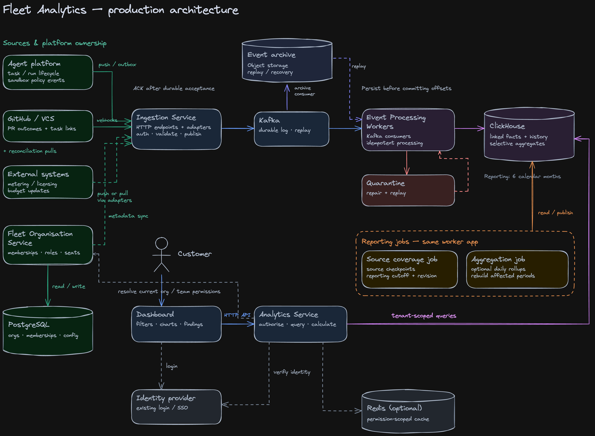

# 03 — Architecture

> **Design direction agreed; production infrastructure is not implemented or capacity-tested.** The prototype dashboard, API, authentication and synthetic dataset are implemented; the production services shown below are a design, not deployed infrastructure. See the [README](../README.md) for current implementation status.
> [Research](00-research.md) owns product scope, the [metrics contract](01-metrics-contract.md) owns calculations, [requirements](02-requirements.md) own behaviour, and the [technical spec](04-technical-spec.md) owns implementation details. This document does not expand prototype scope.

## 1. Context and scale

Fleet connects agent execution, spend and PR outcomes. Correct attribution, tenant isolation and honest missing-data states take priority over real-time reporting. The dashboard reports complete UTC days.

**Illustrative production sizing:** 1 million registered engineers, 200,000 daily active engineers, 10 tasks per active engineer and 20 analytics events per task imply 2 million tasks and 40 million events/day: approximately 463 events/second average, or 4,630 at an assumed 10× peak. These are planning assumptions, not measured capacity. Token streams and execution logs are excluded; registered users are not concurrent executions.

**Reporting horizon:** six calendar months ending at the exclusive UTC-midnight cutoff. Custom ranges inside coverage are supported; 7/30/90 days are presets, not a maximum. Older baselines may be unavailable: current values still render, comparisons use the contract's unavailable states and affected rules are not evaluated. The prototype's fixed 180-day dataset is a separate configuration.

## 2. System overview

### 2.1 Production



[Editable Excalidraw diagram](https://app.excalidraw.com/s/4xzDjFoBBBy/ANfYvowKjOP).

*Boxes represent logical responsibilities, not a microservice per box. Six months is the reporting horizon, not a shared expiry policy for Kafka, archives and backups.*

| Component | Responsibility |
|---|---|
| Agent platform | Own task/run outcomes; trusted runtime components report usage and policy events. Publish through a durable outbox/publisher. |
| GitHub / external adapters | Receive verified PR webhooks and import metering/licensing updates; use reconciliation to recover missed changes. |
| Organisation service + PostgreSQL | Own users, memberships, roles, budgets and configuration. Sync analytical dimensions without making historical copies authoritative for current access. |
| Ingestion service | Authenticate producers, validate payloads and tenant mappings, publish to Kafka; acknowledge only after durable acceptance. |
| Kafka | Buffer outages and support retained replay and independent consumers. Partition by stable tenant/entity identity; ordering is per partition, not global. |
| Event-processing workers | Normalise, link and version facts; handle replay safely; persist required effects before committing offsets. Quarantine invalid records for repair. |
| ClickHouse | Store analytical facts and relevant lifecycle history; support direct queries and selective aggregates. |
| Event archive | An independent consumer writes source events to object storage and tracks its own progress. Replay uses the normal processing path. |
| Source coverage job | Track source checkpoints and gaps; support publication of a reporting cutoff and revision. |
| Aggregation job — optional | Precompute expensive repeated queries; detailed records remain available for other metrics. |
| Analytics service | Authorise, validate filters, query populations, derive metrics and redact results before returning them. |
| Redis — optional | Cache by tenant, effective permission scope, filters, metric version and reporting revision. Never bypass authorisation. |

### 2.2 Prototype

React calls a Spring Boot HTTP API backed by PostgreSQL. The API provides signed-JWT login, organisation-scoped queries, metric calculations and role-based redaction. jOOQ handles SQL; Flyway owns migrations. An explicit deterministic seeder replaces upstream integrations. Two demo organisations have ADMIN and VIEWER accounts; switching organisations requires signing into another account.

Kafka, ClickHouse, archival, Redis, external ingestion and reporting workers are production-only. The prototype exercises real persistence and calculations, not canned chart responses. Production requires different ingestion, analytical queries and consistency mechanisms—not merely a database-adapter swap.

## 3. Data model and retrieval

### 3.1 Records and identity

| Record | Relationship |
|---|---|
| Task | Organisation, owner and creation-time team/repository attribution |
| Run | Execution attempt belonging to a task |
| PR | Explicit task link and originating run where known; lifecycle outcomes |
| Usage record | Stable metering identity linked to a run, including work without a PR |
| Denial event | Task and optional run link |
| Licences / budgets | Licensed population and monthly organisation/team budgets; separate entities |

Keep entity identity, delivery identity and source version distinct. Duplicate deliveries must not create additional business facts. Reliable source versions govern updates; arrival order alone does not establish newer business state. Ambiguous updates need source-specific handling and reconciliation.

### 3.2 History, summaries and retention

Keep detailed facts and relevant lifecycle history alongside current projections. Opened, reviewed and merged are events about one PR, not three PRs. Capturing additional history enables future metrics without adding them to P0.

Retain the context needed for six-month reporting, including older task/run attribution referenced by in-window outcomes and open work. Expiry must be dependency-aware, not simply “delete everything created six months ago.” Longer archival retention is not implicitly approved by the reporting horizon.

Aggregates are rebuildable accelerators, never replacements for facts. Pool counts before calculating rates; do not sum daily distinct users into monthly active users. Cohorts require task links and observation cutoffs. New metrics cannot recover information never collected or already expired.

### 3.3 The retrieval boundary

Queries explicitly carry tenant, filters, timestamp basis and reporting revision. Period metrics use their own event timestamps. The funnel selects tasks by creation time and follows outcomes through `dataThrough`. Comparisons, the 28-day failure baseline and budget month each use their own window. The organisation benchmark drops the team filter but retains the repository filter.

The prototype uses jOOQ/PostgreSQL for selection and population totals within one `REPEATABLE READ` transaction. Java derives ratios, gates, states and ranking. Production uses ClickHouse-specific queries over canonical facts. Avoid joining independent one-to-many branches before summing costs. See the [data model](04-technical-spec.md#3-data-model-and-lifecycle) and [request flow](04-technical-spec.md#4-request-and-calculation-flow) for the implemented query path.

## 4. Ingestion and recovery

Ingestion maps validated source payloads into a shared Fleet envelope before Kafka. For example, a normalised merge event looks like this (illustrative identifiers; the full field rules are in the reference):

```json
{
  "schema_version": 1,
  "event_id": "github-delivery-abc123",
  "event_type": "pr.merged",
  "source": "github-installation-123",
  "org_id": "org_example",
  "entity_type": "pull_request",
  "entity_id": "github-pr-98765",
  "occurred_at": "2026-09-06T14:30:00Z",
  "ingested_at": "2026-09-06T14:30:03Z",
  "source_version": null,
  "payload": {
    "repository_source_id": "github-repo-456",
    "pr_number": 42,
    "target_branch": "main",
    "merged_at": "2026-09-06T14:30:00Z"
  }
}
```

Event identity deduplicates delivery; entity identity links the PR; a reliable source version orders corrections when available. Workers resolve Fleet task links separately. Processing and archival consume Kafka independently: the archive is not an intermediate step before ClickHouse. See [proposed production event contracts](reference/event-schemas.md) for payload families, examples and recovery rules; these are not prototype HTTP endpoints.

Delivery is at least once, not an end-to-end exactly-once claim. Workers commit offsets after required writes are durably accepted. A crash between write and offset commit causes replay; stable event and business identities must prevent duplicate logical effects. Never commit past an earlier failed record within a partition.

**ClickHouse correctness:** queries must resolve duplicate events and entity versions before counting or summing. Background merging alone is insufficient; use an explicitly validated query-time deduplication strategy where duplicates remain. ReplacingMergeTree can serve current projections, but history needs separate retention. Do not feed duplicate-prone inserts into irreversible additive rollups. The PostgreSQL deduplication-ledger-plus-fact transaction does not transfer unchanged. [ClickHouse guidance](https://clickhouse.com/docs/concepts/features/operations/update/replacing-merge-tree).

**Reconciliation:** GitHub webhooks provide normal updates. A background worker retries failed work, checks source changes and persists progress. Schedule by provider limits, tenant activity and recovery backlog rather than one fixed interval for every tenant. Unresolved gaps remain visible. Recovering current PR state does not necessarily recover every historical transition.

**Failures:** Kafka unavailability prevents successful ingestion acknowledgement without another durable inbox. Database outages pause consumer acknowledgement and trigger retries. Non-processable events go to durable quarantine, not silent deletion. Archive progress is independent of analytics offsets. All buffers are finite; Kafka replay is not a substitute for backups.

## 5. Reporting coverage and consistency

- **Coverage:** track completeness by source/day. An empty Kafka backlog or reachable source does not prove complete data.
- **Publication:** expose a complete-day reporting interval, revision and source status. An incomplete source makes dependent metrics `missing_data`, not zero; unrelated sections remain available. Reject selected ranges outside coverage; unavailable baselines do not invalidate current values.
- **Consistent reads:** all sections must use one coherent revision. The prototype uses fixed publication metadata and a database read snapshot. Production needs a protocol that exposes a revision only when its required facts and summaries are query-visible. A revision label alone is not a cross-table snapshot.

Late events can correct facts and trigger rebuilding of affected summaries before a corrected revision is exposed. The production publication protocol and replica-read behaviour must be specified and tested before launch ([Production validation before launch](#10-production-validation-before-launch)); they are not assumed ClickHouse guarantees.

## 6. Identity and trust boundaries

The identity provider establishes identity; the organisation service determines current membership and permissions. The analytics service authorises tenant and filters before querying and redacts restricted evidence before serialization. Historical task attribution never grants current access. Producer credentials and source-to-tenant mappings form a separate ingestion trust boundary.

Prototype ADMIN and VIEWER accounts share their organisation's dashboard; only ADMIN sees denied-domain detail. Raw domains and internal domain-bearing identifiers must not leak through other fields or links. The technical spec defines keyed pseudonymous finding IDs: stable correlation is accepted, not claimed to be anonymity.

Production requires least-privilege credentials, encrypted transport/storage, secret rotation, storage-level isolation safeguards and revocation-aware caching. The prototype does not demonstrate SSO, registration/reset, refresh/revocation or production hardening. Fleet collects operational metadata, not prompts, model responses or source-code contents.

## 7. Production task lifecycle and retry ownership

The platform orchestrator owns lifecycle decisions; analytics observes them.

- **Run:** `pending → running → {completed | failed | cancelled | timed_out}`.
- **Task:** `created → queued → running → {completed | failed | cancelled}`.
- A failed run is not a failed task while another attempt is planned. Exhausted or non-retryable execution can end in failure; explicit cancellation remains cancellation.
- Record retry ownership as platform- or user-initiated. The demo's one-run-per-task rule is a dataset restriction.

### 7.1 Lifecycle history

Retain relevant retry and PR transitions instead of overwriting all history. Reopened/retargeted PRs require an explicit future metric-contract extension; their semantics are not silently added to the demo. Recalculation is bounded by retained facts and source coverage, not a promise to reproduce every historical dashboard publication.

## 8. Prototype boundary

| Capability | Assignment prototype | Production target |
|---|---|---|
| Foundation | Build, migrations and automated checks implemented | Deployment and recovery validation required |
| UI, login, API, metrics, redaction | Implemented; see the execution record for verification | Same product semantics, validated at scale |
| Data | Explicit synthetic seeder; fixed 180-day dataset | Upstream ingestion; six-calendar-month reporting |
| Storage | PostgreSQL, Flyway, jOOQ | PostgreSQL metadata + ClickHouse analytics + archival |
| Consistency | Fixed publication and transactional reads | Source coverage and coherent publication protocol |
| Kafka, reconciliation, optional cache/rollups | Not implemented | Production responsibilities |
| Agent execution and billing providers | Not built | External authoritative systems |

The small hand-checkable contract fixture and larger demo dataset are different. See [demo data](04-technical-spec.md#6-demo-data) for dates, population sizes and budgets, and the [execution record](06-plan.md) for checks actually run.

## 9. Decisions and trade-offs

| Decision | Benefit | Cost / alternative |
|---|---|---|
| Kafka | Replay and independent consumers | More operations than a managed queue; throughput alone does not require it |
| ClickHouse + PostgreSQL | Separate analytical scans from mutable operational records | Two storage models; explicit duplicate handling and reporting consistency |
| Detailed facts; optional aggregates | Future metrics and cohort investigation | More retention/query cost than summaries alone |
| Six-month reporting | Bounded customer history | Oldest baselines may be unavailable; referenced entities need older context |
| Webhooks + reconciliation | Normal low latency with gap recovery | Provider quotas and incomplete historical recovery |
| Optional Redis | Faster repeated queries | Invalidation, permission scoping and bounded database fallback |
| Small PostgreSQL prototype | Real SQL and customer behaviour | Does not prove the production infrastructure |

## 10. Production validation before launch

The direction is selected; these are delivery gates, not completed work:

- Prove replay safety, out-of-order handling and recovery after a crash between database write and offset commit.
- Specify and test the ClickHouse publication protocol, canonical queries, replica visibility and corrections across facts and summaries.
- Benchmark largest-tenant queries, concurrent reads, ingestion peaks and outage catch-up; choose partitioning, replication and latency budgets from evidence.
- Set Kafka replay duration and archive/backup lifecycle policies; test dependency-aware expiry, deletion and restoration. Six-month reporting alone does not set physical retention.
- Tune reconciliation against provider quotas and acceptable reporting delay; demonstrate gap disclosure and recovery.
- Validate access revocation, cross-tenant denial and cache isolation. Set recovery objectives and operational monitoring even though those tools are omitted from the diagram.

The prototype demonstrates product behaviour and metric correctness as implemented, not completion of these production gates.
